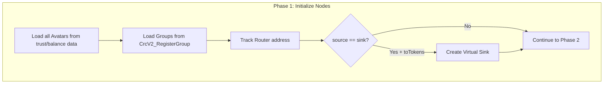
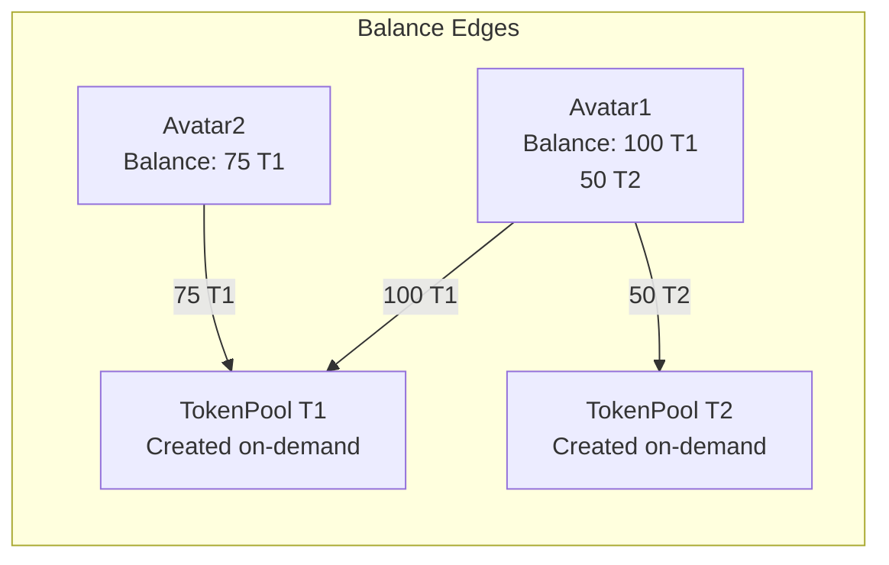
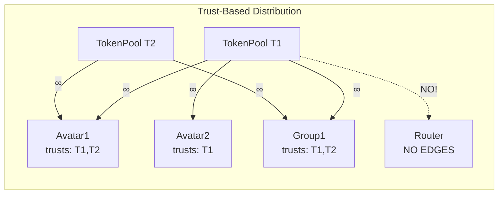
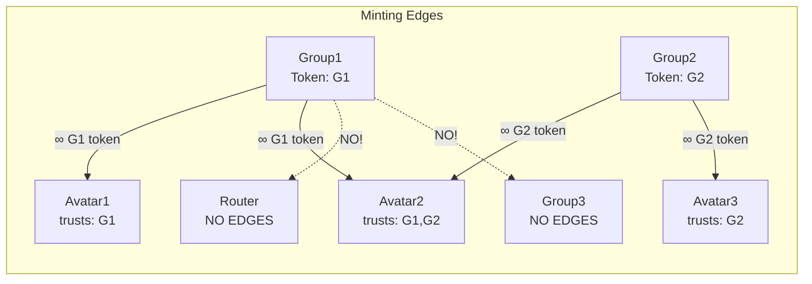
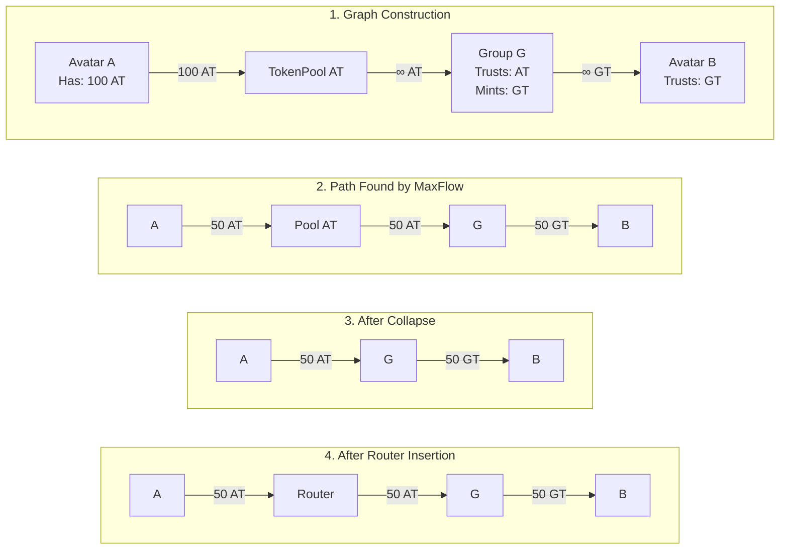

# Circles Pathfinder: Node Types & Graph Construction

## Node Types in Detail

### 1. Avatar Node
**When Created**: During graph initialization from trust/balance data  
**Used In**: Graph construction & pathfinding  
**Properties**:
- Represents a user account address
- Can hold token balances
- Can establish trust relationships
- Can be source/sink (except Router & Groups)

### 2. TokenPool Node  
**When Created**: Dynamically during graph construction  
**Used In**: Graph construction & pathfinding (removed in post-processing)  
**Properties**:
- Virtual node (not in database)
- One per unique token in the system
- ID format: `tpool-{tokenId}`
- Aggregates all holders of a specific token
- Acts as distribution hub

### 3. Group Node
**When Created**: Loaded from database during graph initialization  
**Used In**: Graph construction & pathfinding  
**Properties**:
- Special avatar that mints tokens
- Group address = Group token address
- Cannot be source or sink
- Stored in `CrcV2_RegisterGroup` table
- Can trust other tokens (receive them)
- Can mint unlimited own tokens

### 4. Router Node
**When Created**: Tracked during graph init, used in post-processing only  
**Used In**: NOT in capacity graph, only in final output  
**Properties**:
- Address: `0xdc287474114cc0551a81ddc2eb51783fbf34802f`
- No edges during graph construction
- Inserted between Avatar→Group transfers after pathfinding
- Preserves token identity (no transformation)

### 5. Virtual Sink Node
**When Created**: Only when `source == sink && toTokens.length > 0`  
**Used In**: Graph construction & pathfinding (replaced in output)  
**Properties**:
- ID format: `{sourceId}_virtual_sink`
- Enables token-to-token conversion
- Trusts only tokens in `toTokens` that source also trusts
- Replaced with real sink address in final output

## Graph Construction Flow



## Edge Construction in Detail

### Phase 1: Avatar → TokenPool Edges



**Node Creation**:
```csharp
foreach (balance in balances) {
    // Skip Router and Groups - they don't use pools
    if (IsRouter(balance.Holder) || IsGroup(balance.Holder)) continue;
    
    // Create TokenPool node if doesn't exist
    int poolId = AddressIdPool.TokenPoolIdOf(balance.Token);
    graph.AddTokenNode(balance.Token, poolId);
    
    // Add edge with balance as capacity
    graph.AddCapacityEdge(
        from: balance.Holder,
        to: poolId,
        token: balance.Token,
        capacity: balance.Amount
    );
}
```

### Phase 2: TokenPool → Avatar/Group Edges



**Key Points**:
- Router NEVER receives from TokenPools
- Groups CAN receive from TokenPools (for tokens they trust)
- Capacity always ∞ (unlimited)

### Phase 3: Group → Avatar Minting Edges



**Implementation**:
```csharp
foreach (group in groups) {
    int groupToken = group; // Group IS its token
    
    foreach (avatar in avatars) {
        // Skip Router and other Groups
        if (IsRouter(avatar) || IsGroup(avatar)) continue;
        
        if (trustsToken(avatar, groupToken)) {
            graph.AddCapacityEdge(
                from: group,
                to: avatar,
                token: groupToken,
                capacity: long.MaxValue
            );
        }
    }
}
```

## Complete Flow Example



## Node Presence by Phase

| Node Type | Graph Construction | MaxFlow | Path Collapse | Post-Process | Final Output |
|-----------|-------------------|---------|---------------|--------------|--------------|
| Avatar | ✓ | ✓ | ✓ | ✓ | ✓ |
| TokenPool | ✓ | ✓ | Removed | - | - |
| Group | ✓ | ✓ | ✓ | ✓ | ✓ |
| Router | Tracked only | - | - | Inserted | ✓ |
| Virtual Sink | ✓ (conditional) | ✓ | ✓ | Replaced | - |

## Critical Implementation Rules

1. **TokenPool Creation**: Created on-demand when first balance references the token
2. **Router Isolation**: Router node exists but has ZERO edges during graph construction
3. **Group Direct Access**: Groups receive directly from TokenPools (no Router needed here)
4. **Minting Restriction**: Groups only send their own token, only to Avatars
5. **Post-Process Router**: Router inserted ONLY between Avatar→Group, preserving token identity