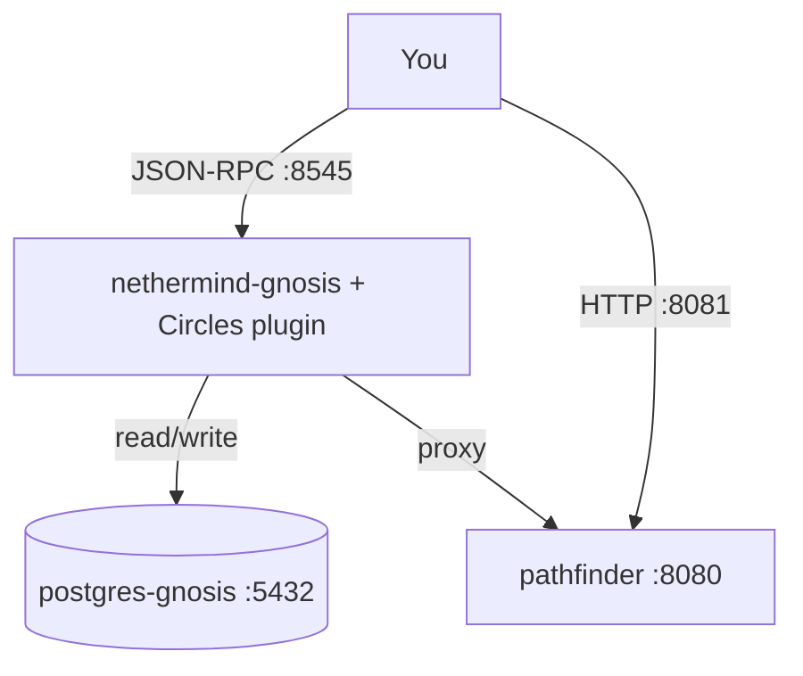

# Circles Nethermind Plugin (Indexer + Pathfinder)

This repo is centered around two pieces that are typically deployed together:

- **Indexer (Nethermind plugin)**: indexes Circles protocol events into Postgres and exposes them via extra **JSON-RPC methods**.
- **Pathfinder (HTTP service)**: computes **transitive transfer paths** in the Circles v2 trust/balance graph (MaxFlow). The plugin can proxy to it via `circlesV2_findPath`.

If you just want to query Circles data, the fastest path is: start the included `docker-compose` stack, wait for the node to sync, then use the node’s JSON-RPC.

---

## What you get

### Indexer (Nethermind plugin)

- Indexes Circles **v1 + v2** events (plus several v2 satellite contracts) into Postgres.
- Adds a JSON-RPC module called **`Circles`** (served from the same RPC port as Nethermind).
- Provides:
  - event/history queries (`circles_events`)
  - table/query DSL access (`circles_query`, `circles_tables`)
  - derived helpers (balances, profiles, trust)

### Pathfinder (HTTP service)

- Computes a set of transfers that achieves a requested flow.
- Supports token restrictions (`FromTokens`, `ToTokens`), exclusions, simulated balances/trusts, optional group minting.
- Exposes:
  - `POST /findPath`
  - `GET /snapshot`

The plugin proxies these via:

- `circlesV2_findPath`
- `circles_getNetworkSnapshot`

---

## Architecture



---

## Quick start (docker-compose)

The repo currently includes a **Gnosis Chain** compose setup: `docker-compose.gnosis.yml`.

### Prereqs

- Docker + Docker Compose (v2)
- Enough disk for an execution + consensus sync

### 1) Configure env

```bash
cp .env.example .env
```

Optional (Linux/macOS): ensure the generated JWT file ends up owned by you:

```bash
export MY_UID="$(id -u)"
export MY_GID="$(id -g)"
```

### 2) Start the stack

```bash
docker compose -f docker-compose.gnosis.yml up -d --build
```

### 3) Sanity check

Indexer health:

```bash
curl -s http://localhost:8545/ \
  -H 'content-type: application/json' \
  --data '{"jsonrpc":"2.0","id":1,"method":"circles_health","params":[]}' | jq
```

Discover indexed tables:

```bash
curl -s http://localhost:8545/ \
  -H 'content-type: application/json' \
  --data '{"jsonrpc":"2.0","id":1,"method":"circles_tables","params":[]}' | jq
```

### Ports

- `8545/tcp` Nethermind JSON-RPC (includes `Circles` module)
- `8081/tcp` Pathfinder HTTP API (mapped from container `:8080`)
- `5432/tcp` Postgres
- `30303/tcp+udp` Nethermind p2p
- `9000/tcp+udp` Lighthouse p2p
- `5054/tcp` Lighthouse metrics
- `3000/tcp` Profile pinning service (optional)

### Data volumes

Everything persistent is under `./.state/` (nethermind db, lighthouse db, postgres data, jwt secret).

### Reset / start fresh

```bash
docker compose -f docker-compose.gnosis.yml down
rm -rf ./.state
```

---

## API

**JSON-RPC endpoint:** `http://localhost:8545`  
**RPC module:** `Circles` (methods are named `circles_*` and `circlesV2_*`)

**Pathfinder HTTP endpoint:** `http://localhost:8081`

### Most used RPC calls

| Method | What it does |
|---|---|
| `circles_health` | quick “is the plugin alive / DB reachable?” check |
| `circles_tables` | discover namespaces/tables/columns |
| `circles_query` | query any indexed table/view (see Query DSL) |
| `circles_events` | address-centric event stream over a block range |
| `circles_getTokenBalances` | balance breakdown across tokens (v1 + v2) |
| `circles_getTotalBalance` / `circlesV2_getTotalBalance` | total v1/v2 balance (timecircles by default) |
| `circlesV2_findPath` | proxy: compute a v2 transfer path (MaxFlow) |
| `circles_getNetworkSnapshot` | proxy: pathfinder snapshot |
| `circles_searchProfiles` | full-text search over indexed profiles |

For full signatures + behavior details, see:

- [`docs/rpc-reference.md`](docs/rpc-reference.md)
- [`docs/query-dsl.md`](docs/query-dsl.md)

### Minimal examples

#### Query a table

```bash
curl -s http://localhost:8545/ \
  -H 'content-type: application/json' \
  --data '{
    "jsonrpc":"2.0",
    "id":1,
    "method":"circles_query",
    "params":[{
      "Namespace":"V_Crc",
      "Table":"Avatars",
      "Columns":[],
      "Filter":[],
      "Order":[
        {"Column":"blockNumber","SortOrder":"DESC"},
        {"Column":"transactionIndex","SortOrder":"DESC"},
        {"Column":"logIndex","SortOrder":"DESC"}
      ],
      "Limit":25
    }]
  }' | jq
```

#### Get total balance (v2)

```bash
curl -s http://localhost:8545/ \
  -H 'content-type: application/json' \
  --data '{
    "jsonrpc":"2.0",
    "id":1,
    "method":"circlesV2_getTotalBalance",
    "params":["0xde374ece6fa50e781e81aac78e811b33d16912c7"]
  }' | jq
```

**Returns**: Total v2 balance as TimeCircles (default) or raw atto units.

#### Find a path (v2)

```bash
curl -s http://localhost:8545/ \
  -H 'content-type: application/json' \
  --data '{
    "jsonrpc":"2.0",
    "id":1,
    "method":"circlesV2_findPath",
    "params":[{
      "Source":"0x749c930256b47049cb65adcd7c25e72d5de44b3b",
      "Sink":"0xde374ece6fa50e781e81aac78e811b33d16912c7",
      "TargetFlow":"1000000000000000000",
      "FromTokens":[],
      "ToTokens":[]
    }]
  }' | jq
```

**Returns**: Computed transfer path with max flow and individual transfers.

#### Get trust relations

```bash
curl -s http://localhost:8545/ \
  -H 'content-type: application/json' \
  --data '{
    "jsonrpc":"2.0",
    "id":1,
    "method":"circles_getTrustRelations",
    "params":["0xde374ece6fa50e781e81aac78e811b33d16912c7"]
  }' | jq
```

**Returns**: Incoming and outgoing trust relations for the address.

#### Get common trust

```bash
curl -s http://localhost:8545/ \
  -H 'content-type: application/json' \
  --data '{
    "jsonrpc":"2.0",
    "id":1,
    "method":"circles_getCommonTrust",
    "params":[
      "0xde374ece6fa50e781e81aac78e811b33d16912c7",
      "0xe8fc7a2d0573e5164597b05f14fa9a7fca7b215c"
    ]
  }' | jq
```

**Returns**: Array of addresses that both avatars commonly trust.

#### List indexed tables

```bash
curl -s http://localhost:8545/ \
  -H 'content-type: application/json' \
  --data '{
    "jsonrpc":"2.0",
    "id":1,
    "method":"circles_tables",
    "params":[]
  }' | jq
```

**Returns**: All indexed tables and columns grouped by namespace.

#### Database health check

```bash
curl -s http://localhost:8545/ \
  -H 'content-type: application/json' \
  --data '{
    "jsonrpc":"2.0",
    "id":1,
    "method":"circles_health",
    "params":[]
  }' | jq
```

**Returns**: Plugin health status and database connectivity check.

#### Get avatar info

```bash
curl -s http://localhost:8545/ \
  -H 'content-type: application/json' \
  --data '{
    "jsonrpc":"2.0",
    "id":1,
    "method":"circles_getAvatarInfo",
    "params":["0xde374ece6fa50e781e81aac78e811b33d16912c7"]
  }' | jq
```

**Returns**: Essential avatar information (type, version, token addresses, CID).

For batch queries:

```bash
curl -s http://localhost:8545/ \
  -H 'content-type: application/json' \
  --data '{
    "jsonrpc":"2.0",
    "id":1,
    "method":"circles_getAvatarInfoBatch",
    "params":[[
      "0xde374ece6fa50e781e81aac78e811b33d16912c7",
      "0xe8fc7a2d0573e5164597b05f14fa9a7fca7b215c"
    ]]
  }' | jq
```

#### Get profile CID

```bash
curl -s http://localhost:8545/ \
  -H 'content-type: application/json' \
  --data '{
    "jsonrpc":"2.0",
    "id":1,
    "method":"circles_getProfileCid",
    "params":["0xde374ece6fa50e781e81aac78e811b33d16912c7"]
  }' | jq
```

**Returns**: Profile CID for the avatar.

For batch queries:

```bash
curl -s http://localhost:8545/ \
  -H 'content-type: application/json' \
  --data '{
    "jsonrpc":"2.0",
    "id":1,
    "method":"circles_getProfileCidBatch",
    "params":[[
      "0xde374ece6fa50e781e81aac78e811b33d16912c7",
      "0xe8fc7a2d0573e5164597b05f14fa9a7fca7b215c"
    ]]
  }' | jq
```

#### Get profile by CID

```bash
curl -s http://localhost:8545/ \
  -H 'content-type: application/json' \
  --data '{
    "jsonrpc":"2.0",
    "id":1,
    "method":"circles_getProfileByCid",
    "params":["Qmb2s3hjxXXcFqWvDDSPCd1fXXa9gcFJd8bzdZNNAvkq9W"]
  }' | jq
```

**Returns**: Profile data for the given CID.

For batch queries:

```bash
curl -s http://localhost:8545/ \
  -H 'content-type: application/json' \
  --data '{
    "jsonrpc":"2.0",
    "id":1,
    "method":"circles_getProfileByCidBatch",
    "params":[[
      "Qmb2s3hjxXXcFqWvDDSPCd1fXXa9gcFJd8bzdZNNAvkq9W",
      "QmZuR1Jkhs9RLXVY28eTTRSnqbxLTBSoggp18Yde858xCM"
    ]]
  }' | jq
```

#### Get profile by address

```bash
curl -s http://localhost:8545/ \
  -H 'content-type: application/json' \
  --data '{
    "jsonrpc":"2.0",
    "id":1,
    "method":"circles_getProfileByAddress",
    "params":["0xde374ece6fa50e781e81aac78e811b33d16912c7"]
  }' | jq
```

**Returns**: Profile data for the given avatar address.

For batch queries:

```bash
curl -s http://localhost:8545/ \
  -H 'content-type: application/json' \
  --data '{
    "jsonrpc":"2.0",
    "id":1,
    "method":"circles_getProfileByAddressBatch",
    "params":[[
      "0xde374ece6fa50e781e81aac78e811b33d16912c7",
      "0xe8fc7a2d0573e5164597b05f14fa9a7fca7b215c"
    ]]
  }' | jq
```

#### Get token info

```bash
curl -s http://localhost:8545/ \
  -H 'content-type: application/json' \
  --data '{
    "jsonrpc":"2.0",
    "id":1,
    "method":"circles_getTokenInfo",
    "params":["0x0d8c4901dd270fe101b8014a5dbecc4e4432eb1e"]
  }' | jq
```

**Returns**: Token metadata for the given token address.

For batch queries:

```bash
curl -s http://localhost:8545/ \
  -H 'content-type: application/json' \
  --data '{
    "jsonrpc":"2.0",
    "id":1,
    "method":"circles_getTokenInfoBatch",
    "params":[[
      "0x0d8c4901dd270fe101b8014a5dbecc4e4432eb1e",
      "0x42cedde51198d1773590311e2a340dc06b24cb37"
    ]]
  }' | jq
```

#### Get network snapshot

```bash
curl -s http://localhost:8545/ \
  -H 'content-type: application/json' \
  --data '{
    "jsonrpc":"2.0",
    "id":1,
    "method":"circles_getNetworkSnapshot",
    "params":[]
  }' | jq
```

**Returns**: Full network snapshot with current trust relations and balances.

#### Search profiles

```bash
curl -s http://localhost:8545/ \
  -H 'content-type: application/json' \
  --data '{
    "jsonrpc":"2.0",
    "id":1,
    "method":"circles_searchProfiles",
    "params":["alice", 10, 0]
  }' | jq
```

**Returns**: Profile search results matching the query text.

### Example request collections

These are copy/paste-friendly and cover all RPC methods:

- [`general-example-requests.md`](general-example-requests.md)
- [`v1-example-requests.md`](v1-example-requests.md)
- [`v2-example-requests.md`](v2-example-requests.md)

---

## Reference

- **RPC reference**: [`docs/rpc-reference.md`](docs/rpc-reference.md)
- **Query DSL**: [`docs/query-dsl.md`](docs/query-dsl.md)
- **Update node and backfill**: [`docs/update-node-and-backfill.md`](docs/update-node-and-backfill.md)
- **Schema browser**: [`all_tables.html`](all_tables.html) (static snapshot) and `circles_tables()` (live)
- **Pathfinder deep dives**:
  - [`Circles.Pathfinder/README.md`](Circles.Pathfinder/README.md)
  - [`Circles.Pathfinder/PATHFINDER.md`](Circles.Pathfinder/PATHFINDER.md)
- **Profiles downloader / IPFS**: [`Circles.Index.Profiles/manual.md`](Circles.Index.Profiles/manual.md)
- **Adding another protocol**: [`docs/adding-protocol.md`](docs/adding-protocol.md)

---

## Development

### Build & test

```bash
dotnet restore
dotnet build
dotnet test
```

### Docker images

- `x64.Dockerfile` / `arm64.Dockerfile`: Nethermind + plugin
- `pathfinder-host.Dockerfile`: Pathfinder host API
- `trust-missing-avatars.Dockerfile`: Trust missing avatars helper

---

## Service: Trust Missing Avatars

The `trust-missing-avatars` service (C#) automates the process of calling `enableCRCForRouting` on the Router contract for avatars that are trusted by a base group but not yet trusted by the Router.

### Configuration (Environment Variables)

These variables can be set in your `.env` file:

| Variable | Description | Default |
|---|---|---|
| `DATABASE_URL` | Postgres connection string. | (Mandatory) |
| `RPC_URL` | JSON-RPC endpoint for the blockchain node. | (Mandatory) |
| `PRIVATE_KEY` | Hex-encoded private key (with or without `0x`) for sending transactions. | (Mandatory) |
| `ROUTER_ADDRESS` | Address of the Circles Router contract. | (Mandatory) |
| `HUB_ADDRESS` | Address of the Circles Hub contract. | `0xc12C...13e8` |
| `BATCH_SIZE` | Number of avatars per transaction (max 200). | `50` |
| `CHECK_HUMANS` | If `true`, calls `isHuman` on the Hub before trusting. | `true` |
| `HUMAN_CHECK_CONCURRENCY` | Parallelism for the human check (max 200). | `25` |

---

## Notes

- **WebSockets / subscriptions**: `eth_subscribe("circles", ...)` requires Nethermind WebSockets to be enabled and exposed. The compose file currently exposes only HTTP RPC (`:8545`). See the RPC reference for details.
- **Indexer start block**: the compose file sets `START_BLOCK=12000000` for the indexer. This affects indexing *inside Postgres*, not Nethermind’s chain sync.
