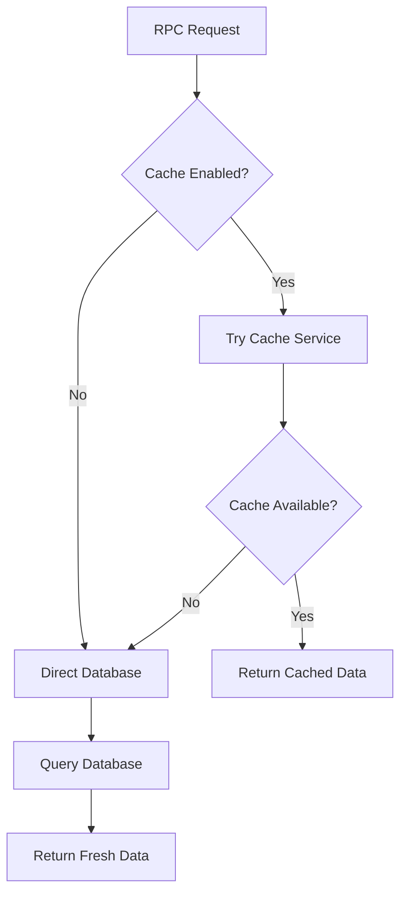

# Circles RPC Host

A JSON-RPC 2.0 service that exposes Circles protocol data and operations through a standardized HTTP API. This service acts as the primary interface for querying Circles blockchain events, user profiles, trust relationships, and pathfinding operations.

## Overview

The RPC Host provides:

- **Balance & Token Queries** - Check CRC holdings and token metadata
- **Profile Management** - Retrieve and search user profiles from IPFS
- **Trust Networks** - Query trust relationships and find common connections
- **Event Indexing** - Access indexed blockchain events with advanced filtering
- **Pathfinding** - Calculate transitive payment paths through the trust network
- **System Health** - Monitor database and blockchain sync status

## Quick Start

### Running Locally

```bash
# Using script (recommended)
./scripts/run-rpc.sh

# Or directly with dotnet
cd src/Rpc/Circles.Rpc.Host
dotnet run
```

Default URL: `http://localhost:8081`

### Configuration

Set environment variables before starting:

```bash
# Required
export POSTGRES_READONLY_CONNECTION_STRING="Host=localhost;Port=5432;Database=postgres;Username=postgres;Password=postgres"
export NETHERMIND_RPC_URL="http://localhost:8545"

# Optional
export BALANCE_MODE="live"  # "live" (eth_call) or "database" (fast but stale)
export DATABASE_QUERY_TIMEOUT_SECONDS=30
export PROFILE_SEARCH_TIMEOUT_SECONDS=30
export EXTERNAL_PATHFINDER_URL="http://localhost:8080"
```

See `.env.example` for full configuration options.

## JSON-RPC 2.0 API

### Request Format

All requests must be valid JSON-RPC 2.0:

```json
{
  "jsonrpc": "2.0",
  "method": "circles_getTotalBalance",
  "params": ["0x1234..."],
  "id": 1
}
```

### Response Format

**Success:**

```json
{
  "jsonrpc": "2.0",
  "result": {...},
  "id": 1
}
```

**Error:**

```json
{
  "jsonrpc": "2.0",
  "error": {
    "code": -32602,
    "message": "Invalid params: Address parameter is required"
  },
  "id": 1
}
```

**Error Codes:**

- `-32600` - Invalid Request
- `-32601` - Method not found
- `-32602` - Invalid params
- `-32603` - Internal server error

## Available RPC Methods

### Balance & Token Methods

#### `circles_getTotalBalance`

Get total V1 Circles balance for an address.

**Parameters:**

- `address` (string) - Ethereum address
- `asTimeCircles` (boolean, optional) - Format as TimeCircles (default: true)

**Returns:** `string` - Total balance

**Example:**

```bash
curl -X POST http://localhost:8081 -H 'Content-Type: application/json' -d '{
  "jsonrpc": "2.0",
  "method": "circles_getTotalBalance",
  "params": ["0xde374ece6fa50e781e81aac78e811b33d16912c7", true],
  "id": 1
}'
```

#### `circlesV2_getTotalBalance`

Get total V2 Circles balance for an address.

**Parameters:** Same as `circles_getTotalBalance`

#### `circles_getTokenBalances`

Get detailed token balances for all tokens held by an address.

**Parameters:**

- `address` (string) - Ethereum address

**Returns:** `CirclesTokenBalance[]` - Array of token balances with metadata

**Response Schema:**

```typescript
{
  tokenAddress: string
  tokenId: string
  tokenOwner: string
  tokenType: string
  version: number
  attoCircles: string
  circles: number
  staticAttoCircles: string
  staticCircles: number
  attoCrc: string
  crc: number
  isErc20: boolean
  isErc1155: boolean
  isWrapped: boolean
  isInflationary: boolean
  isGroup: boolean
}
```

#### `circles_getTokenInfo`

Get metadata for a specific token.

**Parameters:**

- `tokenAddress` (string) - Token address

**Returns:** `TokenInfo`

#### `circles_getTokenInfoBatch`

Get metadata for multiple tokens.

**Parameters:**

- `tokenAddresses` (string[]) - Array of token addresses

**Returns:** `TokenInfo?[]` - Array with nulls for non-existent tokens

### Avatar & Profile Methods

#### `circles_getAvatarInfo`

Get avatar information for an address (V1 and V2 merged).

**Parameters:**

- `address` (string) - Avatar address

**Returns:** `AvatarInfo`

**Response Schema:**

```typescript
{
  version: number
  type: string
  avatar: string
  tokenId: string
  hasV1: boolean
  v1Token: string | null
  cidV0Digest: string
  cidV0: string | null
  isHuman: boolean
  name: string | null
  symbol: string
}
```

#### `circles_getAvatarInfoBatch`

Get avatar information for multiple addresses.

**Parameters:**

- `addresses` (string[])

**Returns:** `AvatarInfo[]`

#### `circles_getProfileCid`

Get the IPFS CID for an avatar's profile.

**Parameters:**

- `address` (string)

**Returns:** `string | null` - CIDv0 string

#### `circles_getProfileCidBatch`

Get profile CIDs for multiple addresses.

**Parameters:**

- `addresses` (string[])

**Returns:** `{ [address: string]: string | null }`

#### `circles_getProfileByCid`

Retrieve a profile from IPFS by its CID.

**Parameters:**

- `cid` (string) - CIDv0 string

**Returns:** `JsonElement | null` - Profile data from IPFS

#### `circles_getProfileByCidBatch`

Retrieve multiple profiles by their CIDs.

**Parameters:**

- `cids` (string[])

**Returns:** `{ [cid: string]: JsonElement | null }`

#### `circles_getProfileByAddress`

Get profile data for an avatar address (CID lookup + IPFS fetch).

**Parameters:**

- `address` (string)

**Returns:** `JsonElement | null` - Profile enriched with avatar type and short name

#### `circles_getProfileByAddressBatch`

Get profiles for multiple addresses.

**Parameters:**

- `addresses` (string[])

**Returns:** `{ [address: string]: JsonElement | null }`

#### `circles_searchProfiles`

Full-text search for profiles.

**Parameters:**

- `text` (string) - Search query (max 3 tokens, each > 1 char)
- `limit` (number, optional) - Max results (default: 20, max: 100)
- `offset` (number, optional) - Pagination offset (default: 0)
- `types` (string[], optional) - Filter by avatar types

**Returns:**

```typescript
{
  total: number
  results: Array<{
    avatar: string
    avatarInfo: AvatarInfo
    profile: JsonElement | null
  }>
}
```

**Example:**

```bash
curl -X POST http://localhost:8081 -H 'Content-Type: application/json' -d '{
  "jsonrpc": "2.0",
  "method": "circles_searchProfiles",
  "params": ["berlin", 10, 0, ["CrcV2_RegisterHuman"]],
  "id": 1
}'
```

### Trust & Network Methods

#### `circles_getTrustRelations`

Get trust relationships for an address.

**Parameters:**

- `address` (string)

**Returns:**

```typescript
{
  user: string
  trusts: Array<{ user: string; limit: number }>
  trustedBy: Array<{ user: string; limit: number }>
}
```

#### `circles_getCommonTrust`

Find addresses that two users both trust.

**Parameters:**

- `address1` (string)
- `address2` (string)
- `version` (number, optional) - Filter by Circles version (1, 2, or null for both)

**Returns:** `string[]` - Array of commonly trusted addresses

**Example:**

```bash
curl -X POST http://localhost:8081 -H 'Content-Type: application/json' -d '{
  "jsonrpc": "2.0",
  "method": "circles_getCommonTrust",
  "params": ["0xaddr1...", "0xaddr2...", 2],
  "id": 1
}'
```

#### `circles_getNetworkSnapshot`

Get a complete snapshot of the Circles trust network.

**Parameters:** None

**Returns:** `NetworkSnapshotResponse` (proxied from Pathfinder service)

#### `circlesV2_findPath`

Calculate a transitive payment path through the trust network.

**Parameters:**

- `flowRequest` (FlowRequest object):
  ```typescript
  {
    source: string;
    sink: string;
    targetFlow: string;
    fromTokens?: string[];  // Source token filter
    toTokens?: string[];    // Destination token filter
    withWrap?: boolean;     // Enable ERC20 wrapping
  }
  ```

**Returns:** `JsonElement` - Path response from Pathfinder

**Example:**

```bash
curl -X POST http://localhost:8081 -H 'Content-Type: application/json' -d '{
  "jsonrpc": "2.0",
  "method": "circlesV2_findPath",
  "params": [{
    "source": "0xsource...",
    "sink": "0xsink...",
    "targetFlow": "1000000000000000000"
  }],
  "id": 1
}'
```

### Event & Query Methods

#### `circles_events`

Query indexed blockchain events with advanced filtering.

**Parameters:**

- `address` (string, optional) - Filter by address
- `fromBlock` (number, optional) - Start block (inclusive)
- `toBlock` (number, optional) - End block (inclusive)
- `eventTypes` (string[], optional) - Filter by event types
- `filterPredicates` (FilterPredicate[], optional) - Advanced filters
- `sortAscending` (boolean, optional) - Sort order (default: false)

**Returns:** `EventsResponse` - Array of events

**Filter Predicates:**
Supports complex filters:

```typescript
{
  type: "FilterPredicate";
  filterType: "Equals" | "In" | "GreaterThan" | "LessThan" | ...;
  column: string;
  value: any;
}
```

**Example:**

```bash
curl -X POST http://localhost:8081 -H 'Content-Type: application/json' -d '{
  "jsonrpc": "2.0",
  "method": "circles_events",
  "params": ["0xaddr...", 30282299, null],
  "id": 1
}'
```

#### `circles_query`

Generic database query interface using structured DTOs.

**Parameters:**

- `query` (SelectDto):
  ```typescript
  {
    namespace: string;
    table: string;
    columns?: string[];
    filter?: FilterPredicate[];
    order?: Array<{ column: string; sortOrder: "ASC" | "DESC" }>;
    limit?: number;
    distinct?: boolean;
  }
  ```

**Returns:**

```typescript
{
  columns: string[];
  rows: Array<{ [key: string]: any }>;
}
```

**Example:**

```bash
curl -X POST http://localhost:8081 -H 'Content-Type: application/json' -d '{
  "jsonrpc": "2.0",
  "method": "circles_query",
  "params": [{
    "namespace": "V_Crc",
    "table": "Avatars",
    "columns": [],
    "limit": 10,
    "order": [{"column": "blockNumber", "sortOrder": "DESC"}]
  }],
  "id": 1
}'
```

### System Methods

#### `circles_health`

Check service health status.

**Parameters:** None

**Returns:** `string` - "Healthy" or error message

**Health Checks:**

- Database connectivity
- Blockchain sync status (when `BALANCE_MODE=live`)
- Pathfinder connectivity

#### `circles_tables`

Get available database tables and schemas.

**Parameters:** None

**Returns:**

```typescript
Array<{
  namespace: string
  tables: Array<{
    table: string
    topic: string
    columns: Array<{ column: string; type: string }>
  }>
}>
```

## Health Check Endpoints

- **`GET /live`** - Liveness probe (service is running)
- **`GET /ready`** - Readiness probe (service is ready to accept traffic)
  - Checks: Nethermind sync status, Pathfinder connectivity
- **`GET /health`** - Nethermind connectivity check
- **`GET /metrics`** - Prometheus metrics (if enabled)

## Balance Modes

The service supports two balance query modes:

### Live Mode (default)

```bash
export BALANCE_MODE="live"
```

- Uses `eth_call` to query live blockchain state
- Accurate, current balances
- Slower, requires Nethermind RPC connection
- Recommended for production

### Database Mode

```bash
export BALANCE_MODE="database"
```

- Queries indexed database
- Fast responses
- May be slightly stale (depends on indexer sync)
- Good for development/testing

## Architecture

### Components

1. **CirclesRpcModule** - Core business logic for all RPC methods, split into partial classes:
   - `CirclesRpcModule.cs` - Transaction history, Events, Pathfinder, SDK endpoints, Query
   - `RpcModule/CirclesRpcModule.Core.cs` - Constructor, fields, connection management
   - `RpcModule/CirclesRpcModule.Balances.cs` - Token balance queries
   - `RpcModule/CirclesRpcModule.Tokens.cs` - Token info and holders
   - `RpcModule/CirclesRpcModule.Avatars.cs` - Avatar information
   - `RpcModule/CirclesRpcModule.Profiles.cs` - Profile CID and content operations
   - `RpcModule/CirclesRpcModule.Trust.cs` - Trust relations
   - `RpcModule/CirclesRpcModule.Groups.cs` - Group operations
   - `RpcModule/CirclesRpcModule.Helpers.cs` - Health and table utilities
2. **CursorUtils.cs** - Cursor-based pagination utilities
3. **Program.cs** - ASP.NET Core app, routes requests to handlers
4. **Settings** - Environment-based configuration
5. **DatabaseSchemaMap** - Maps database schemas for query operations
6. **NethermindRpcClient** - Live balance queries via eth_call
7. **AbiEncoder** - Ethereum ABI encoding for contract calls

### Dependencies

- **Circles.Index.Postgres** - Database access layer
- **Circles.Index.Query** - Query abstractions and DTOs
- **Circles.Pathfinder.DTOs** - Pathfinding request/response types
- **Nethermind RPC** - Live blockchain queries (optional, for balance mode)
- **External Pathfinder** - Pathfinding service (for `circlesV2_findPath`)

### Data Flow

```
Client Request
    ↓
JSON-RPC 2.0 Parser
    ↓
CirclesRpcModule
    ↓
┌─────────────┬───────────────┬──────────────┐
│  Postgres   │  Nethermind   │  Pathfinder  │
│  (Index DB) │  (eth_call)   │  (External)  │
└─────────────┴───────────────┴──────────────┘
    ↓
JSON-RPC 2.0 Response
```

## Development

### Prerequisites

- .NET 9.0 SDK
- PostgreSQL 15+ (with indexed Circles data)
- Nethermind RPC endpoint (optional, for live mode)
- Pathfinder service (optional, for pathfinding methods)

### Testing

```bash
# Run tests
cd src/Rpc/Circles.Rpc.Host.Tests
dotnet test

# Test specific endpoint
curl -X POST http://localhost:8081 -H 'Content-Type: application/json' -d '{
  "jsonrpc": "2.0",
  "method": "circles_health",
  "params": [],
  "id": 1
}'
```

### Adding New RPC Methods

1. Add method signature to `ICirclesRpcModule.cs`
2. Implement method in the appropriate partial class file:
   - Balance/Token queries → `RpcModule/CirclesRpcModule.Balances.cs` or `Tokens.cs`
   - Avatar queries → `RpcModule/CirclesRpcModule.Avatars.cs`
   - Profile queries → `RpcModule/CirclesRpcModule.Profiles.cs`
   - Trust queries → `RpcModule/CirclesRpcModule.Trust.cs`
   - Group queries → `RpcModule/CirclesRpcModule.Groups.cs`
   - System/health → `RpcModule/CirclesRpcModule.Helpers.cs`
   - Transaction/Event/SDK → `CirclesRpcModule.cs` (main file)
3. Add handler function in `Program.cs`
4. Add route mapping in the method switch statement
5. Update this README with method documentation

## Troubleshooting

### Common Issues

**Port 8081 already in use:**

```bash
ASPNETCORE_URLS="http://localhost:8082" ./scripts/run-rpc.sh
```

**Database connection errors:**

```bash
# Check Postgres is running
docker ps | grep postgres

# Test connection
psql -h localhost -U postgres -d postgres -c "SELECT 1"
```

**Pathfinder methods fail:**

```bash
# Ensure pathfinder is running
curl http://localhost:8080/health

# Set pathfinder URL
export EXTERNAL_PATHFINDER_URL="http://localhost:8080"
```

**Balance queries timeout:**

```bash
# Increase timeout
export DATABASE_QUERY_TIMEOUT_SECONDS=60

# Or switch to database mode
export BALANCE_MODE="database"
```

## Performance Tuning

- **Database queries:** Adjust `DATABASE_QUERY_TIMEOUT_SECONDS` (default: 30)
- **Profile search:** Adjust `PROFILE_SEARCH_TIMEOUT_SECONDS` (default: 30)
- **Balance mode:** Use `database` mode for faster responses
- **Connection pooling:** Postgres connection string supports pooling parameters

## Related Documentation

- [Main README](../../../README.md) - Full API documentation with examples
- [DEVELOPMENT.md](../../../DEVELOPMENT.md) - Build and deployment guide
- [scripts/README.md](../../../scripts/README.md) - Script documentation
- [Circles.Pathfinder](../../Pathfinder/Circles.Pathfinder/README.md) - Pathfinding service

## RPC Method Status

This section provides an overview of all available RPC methods, their cache support, and implementation status.

### Core RPC Methods

All 15 core methods are implemented and accessible via RPC:

| Method                                | Status     | Cache Support | Notes               |
| ------------------------------------- | ---------- | ------------- | ------------------- |
| `circles_getTotalBalance`             | ✅ Working | ✅            | Cache + DB fallback |
| `circles_getTokenBalances`            | ✅ Working | ✅            | V1 & V2 tokens      |
| `circles_getAvatarInfo`               | ✅ Working | ✅            | Batch support       |
| `circles_getProfileByAddress`         | ✅ Working | ✅            | IPFS + cache        |
| `circles_getTrustRelations`           | ✅ Working | ❌            | V1 only, no cache   |
| `circles_getAggregatedTrustRelations` | ✅ Working | ❌            | SDK format          |
| `circles_findGroups`                  | ✅ Working | ❌            | Cursor pagination   |
| `circles_getGroupMembers`             | ✅ Working | ❌            | Cursor pagination   |
| `circles_getGroupMemberships`         | ✅ Working | ❌            | Cursor pagination   |
| `circles_getTransactionHistory`       | ✅ Working | ❌            | With circle amounts |
| `circles_getTokenHolders`             | ✅ Working | ❌            | Token distribution  |
| `circles_getCommonTrust`              | ✅ Working | ❌            | V1/V2 support       |
| `circles_events`                      | ✅ Working | ❌            | Advanced filtering  |
| `circles_query`                       | ✅ Working | ❌            | Generic DB query    |
| `circlesV2_findPath`                  | ✅ Working | ❌            | Pathfinder proxy    |

**Count**: 15/15 core methods ✅

### SDK Enablement Methods (✅ Now Fully Implemented & Exposed)

✅ **Complete**: All 8 methods are now implemented in the backend AND exposed via RPC routing in `Program.cs`.

| Method                                        | Purpose                                                      | Replaces  | Status     |
| --------------------------------------------- | ------------------------------------------------------------ | --------- | ---------- |
| `circles_getProfileView`                      | Complete profile (avatar + profile + balances + trust stats) | 6-7 calls | ✅ WORKING |
| `circles_getTrustNetworkSummary`              | Aggregated trust network statistics                          | 3-4 calls | ✅ WORKING |
| `circles_getAggregatedTrustRelationsEnriched` | Trust relations categorized by type + avatar info            | 2-3 calls | ✅ WORKING |
| `circles_getValidInviters`                    | Inviters with sufficient balance                             | 3-4 calls | ✅ WORKING |
| `circles_getTransactionHistoryEnriched`       | Transactions with participant profiles                       | 2-3 calls | ✅ WORKING |
| `circles_searchProfileByAddressOrName`        | Unified search (address or text)                             | 2 calls   | ✅ WORKING |
| `circles_getInvitationOrigin`                 | Reconstructs how user was invited (V1/V2/Escrow/AtScale)     | 4+ calls  | ✅ WORKING |
| `circles_getAllInvitations`                   | All available invitations (trust, escrow, at-scale)          | 6-8 calls | ✅ WORKING |

**Count**: 8/8 Phase 3 methods ✅ (23/23 total methods)

#### Performance Impact

These 7 endpoints reduce SDK round-trips by 60-80% for common operations.


### Cache Support Status

- **Balance methods** (`circles_getTotalBalance`, `circles_getTokenBalances`): ✅ Full cache support with DB fallback
- **Avatar methods** (`circles_getAvatarInfo`): ✅ Full cache support with DB fallback
- **Profile methods** (`circles_getProfileByAddress`): ✅ Full cache support with DB fallback
- **Trust/Query methods**: ❌ No cache support, direct database queries only

#### Cache Architecture

The service supports both cache-enabled and direct database modes:



**Cache benefits**: 2-3x performance improvement for cached endpoints
**Database benefits**: Always fresh data, no cache invalidation concerns
